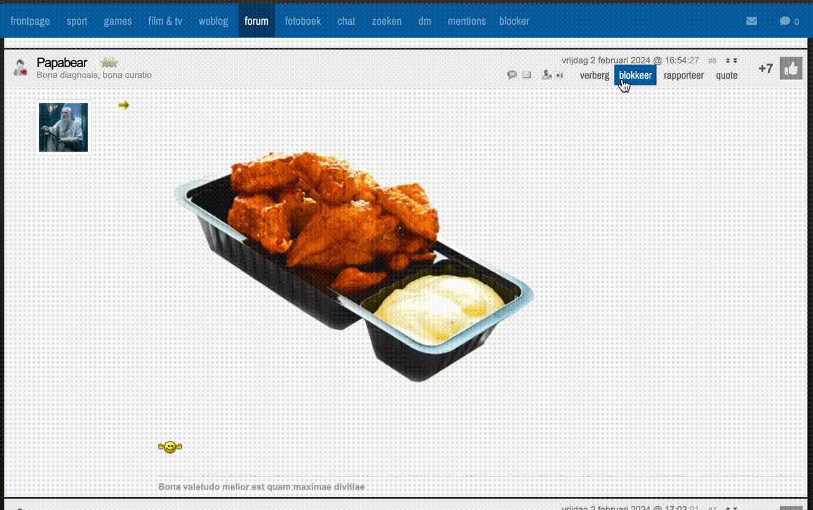
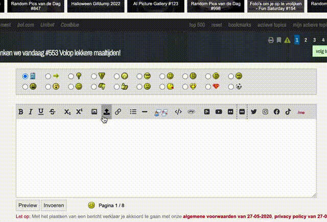
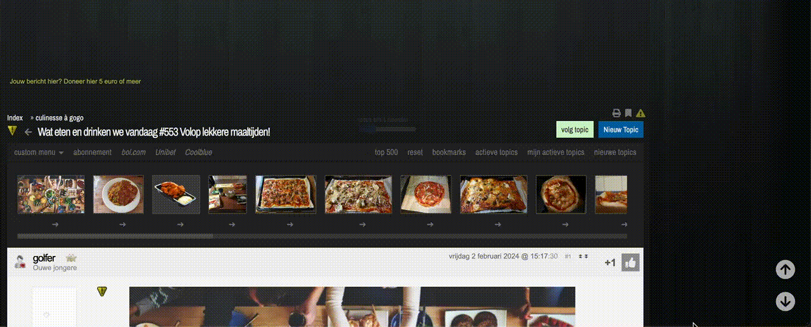
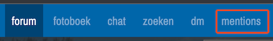
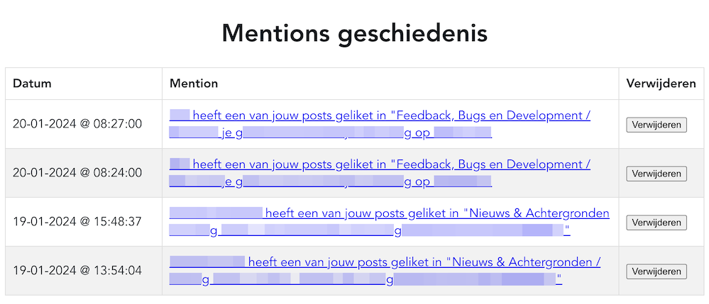

# FOK!Forum Toolkit

Dit is een browser extensie voor het FOK!forum. Het is een verzameling van scripts die het forum een stukje gebruiksvriendelijker maken.

- Alleen actief wanneer je op het forum bent (forum.fok.nl/).
- Deze data wordt opgeslagen in de lokale opslag van je browser:
  - Gebruikersnamen van users die je blockt;
  - Mention tekst;
  - API key voor de plaatjes upload service.
- Niets wordt naar een server gestuurd en je kan je lokale opslag altijd legen.

## Installatie

- [Firefox](https://addons.mozilla.org/en-US/firefox/addon/fok-forum-toolkit/)
- [Chrome](https://chromewebstore.google.com/detail/fokforum-toolkit/aeicidhhmkkbadjpbhnfbnpbokomepfh/)

## Features

- [x] [Gebruikers blokkeren](#blocker)
- [x] [Plaatjes uploaden met één klik](#uploader)
- [x] [Scrollen naar boven en beneden met één klik](#scroller)
- [x] [Mentions geschiedenis](#mentions)

## Verzoeken en bugs

Heb je een verzoek voor een nieuwe feature? Of een bug? Laat het weten in [coming soon](https://forum.fok.nl/topic/).

## Meehelpen

De extensie is open source en iedereen kan meehelpen. Fork de repo, lees de [HOWTO](HOWTO.md) en maak een pull request. Kom je er niet uit? Stel je vraag in [coming soon](https://forum.fok.nl/topic/).

## Blocker

## Uploader

Voegt een knop toe aan de editor om een plaatje te uploaden:

Je moet eerst een [account aanmaken op imgbb](https://imgbb.com/signup), een [api key genereren](https://api.imgbb.com) en daarna de api key invoeren in de extensie:

## Scroller

## Mentions

Voegt een knop toe aan de header die linkt naar een pagina met je mentions geschiedenis:

