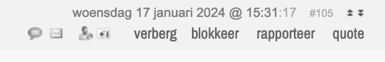
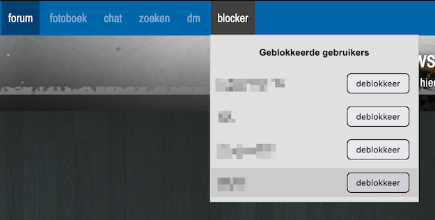
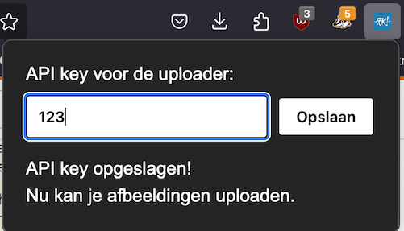
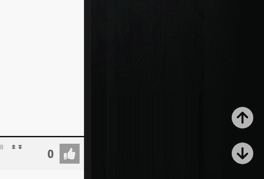

# FOK!Forum Toolkit

Dit is een browser extensie voor het FOK!forum. Het is een verzameling van scripts die het forum een stukje gebruiksvriendelijker maken. De extensie is beschikbaar voor Chrome en Firefox desktop (hopelijk binnenkort ook voor mobiel).

- Alleen actief wanneer je op het forum en in een topic bent (forum.fok.nl/topic/).
- Alleen de volgende data wordt opgeslagen in de lokale opslag van je browser: gebruikersnamen van users die je blockt en een api key voor de plaatjes upload service. Niets wordt naar een server gestuurd en je kan je lokale opslag altijd legen.

## Features

- [x] [Gebruikers blokkeren](#blocker)
- [x] [Plaatjes uploaden met één klik](#uploader)
- [x] [Scrollen naar boven en beneden met één klik](#scroller)
- [ ] Mentions geschiedenis

## Verzoeken en bugs

Heb je een verzoek voor een nieuwe feature? Of een bug? Laat het weten in [coming soon](https://forum.fok.nl/topic/).

## Meehelpen

De extensie is open source en iedereen kan meehelpen. Fork de repo, lees de [HOWTO](HOWTO.md) en maak een pull request. Kom je er niet uit? Stel je vraag in [coming soon](https://forum.fok.nl/topic/).

## Blocker

Voegt een knop toe aan elke post om de gebruiker te blokkeren of om een specifieke post te verbergen:

Voegt een knop toe aan de header van de pagina om geblokkeerde gebruikers te bekijken en deblokkeren:

## Uploader

Voegt een knop toe aan de editor om een plaatje te uploaden:

Je moet eerst een [account aanmaken op imgbb](https://imgbb.com/signup), een [api key genereren](https://api.imgbb.com) en daarna de api key invoeren in de extensie:

## Scroller

Voegt twee knoppen toe aan rechtsonder in de pagina om naar boven en beneden te scrollen:

