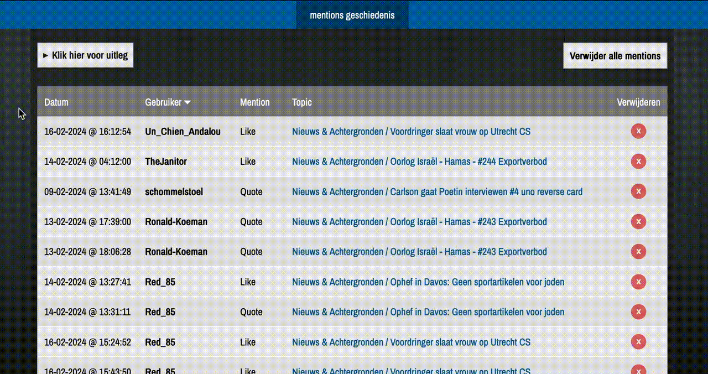
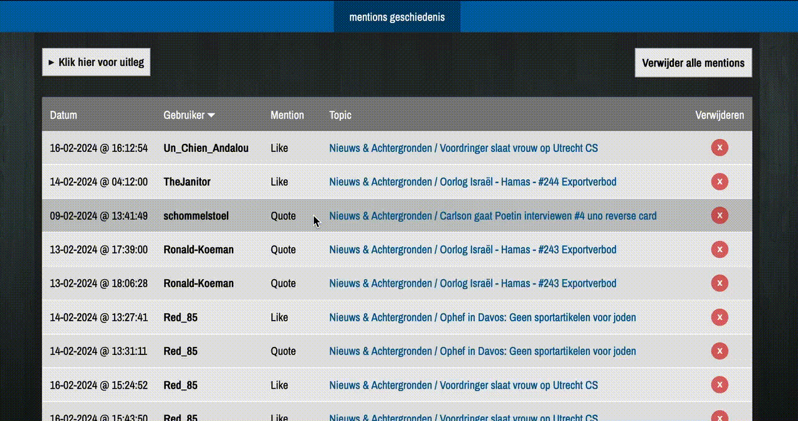

<h1 align="center">

FOK!forum Toolkit
</h1>
<h3 align="center">Een browser extensie die het foum een stukje gebruiksriendelijker probeert te maken.</h3>

  <a href="https://chromewebstore.google.com/detail/fokforum-toolkit/aeicidhhmkkbadjpbhnfbnpbokomepfh?hl=nl">
    <picture>
      <source srcset="https://i.imgur.com/XBIE9pk.png" media="(prefers-color-scheme: dark)">
      </picture></a>
  <a href="https://addons.mozilla.org/en-US/firefox/addon/fok-forum-toolkit/">
    <picture>
      <source srcset="https://i.imgur.com/ZluoP7T.png" media="(prefers-color-scheme: dark)">
      </picture></a>
    

## Wat is het?

Een open-source desktop browser extensie voor het [fok!forum](https://forum.fok.nl/) met features die het foum een stukje gebruiksriendelijker probeert te maken. De extensie en alle features die er in zitten doen niks met je data en slaan informatie alleen op in de lokale opslag van je browser.

## Features

- [x] [Mentions geschiedenis](#mentions)

## Verzoeken, opmerkingen of bugs?

Plaats een reactie op het [het topic op fok](https://forum.fok.nl/topic/2702870/fok-forum-toolkit-browser-extensie.html). Of plaats een [issue](https://github.com/Golannnnn/fok_toolkit/issues).

## Wil je mee helpen ontwikkelen?

Dat zou super cool zijn. Lees hier de [HOWTO](./HOWTO.md) om het project lokaal op te zetten en plaats een PR.

## Mentions

Deze feature slaat je mentions op in de lokale opslag van je browser zodat je ze later altijd terug kan kijken. Je kan je mentions overzichtelijk zien, sorteren, exporteren en importeren en compleet verwijderen.

Sorteren:

Link naar mentions in topic:

